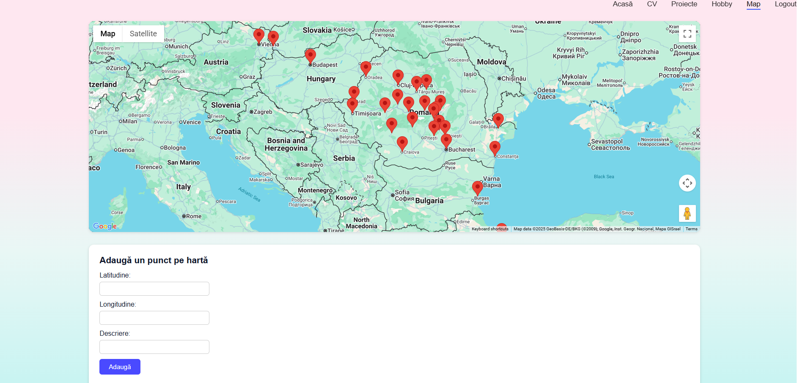

# 🗺️ GeoMap - Interactive PHP & MySQL Location Tracker

A web-based geospatial management system built with **PHP**, **MySQL**, and **Google Maps JavaScript API**. The application provides secure user authentication, persistent session tracking, and an interactive interface for pinning and managing custom geographic coordinates with descriptive markers.

---

## 🚀 Key Features

- **User Authentication & Authorization:** Secure registration and login workflows with credential validation and session-based state management.
- **Dynamic Google Maps Integration:** Interactive map rendering loaded with custom markers, coordinates (lat, long), and responsive info-windows.
- **Relational Data Management:** Persistent storage for user accounts and geolocation points backed by a structured **MySQL** database.
- **Frontend Interactivity:** Dynamic UI updates and asynchronous autocomplete using **jQuery / JavaScript** and custom CSS styling.

---

## 🛠️ Tech Stack

- **Backend:** PHP (Session handling, server-side validation, relational data queries)
- **Database:** MySQL
- **Frontend:** HTML5, CSS3, JavaScript (ES6+), jQuery
- **Third-Party APIs:** Google Maps JavaScript API
- **Version Control:** Git & GitHub

---

## 📂 Project Architecture

GeoMap-PHP-MySQL/
├── css/                    # Custom styling (login.css, map.css, register.css)
├── js/                     # Client-side scripts and API interaction
├── config.php              # Environment and configuration settings
├── db.php                  # MySQL database connection handler
├── login.php               # User login view and authentication logic
├── register.php            # User registration and database insertion
├── logout.php              # Session termination and cleanup
├── map.php                 # Core interactive map view
├── add_point.php           # Backend endpoint to insert coordinate markers
├── get_points.php          # Backend endpoint to fetch persisted map markers
└── README.md               # Project documentation

---

## 💻 Getting Started Locally

### Prerequisites
- Local web server environment (e.g., **XAMPP**, **WAMP**, or **LAMP**)
- **PHP** (v7.4+ or 8.x)
- **MySQL** / MariaDB
- Google Maps API key

### Installation Steps

1. **Clone the repository:**
   git clone https://github.com/Cosmina8/GeoMap-PHP-MySQL.git

2. **Move to web server root:**
   Place the cloned directory into your local server root (e.g., `C:/xampp/htdocs/GeoMap-PHP-MySQL`).

3. **Database Configuration:**
   - Open phpMyAdmin or your MySQL client and create a new database.
   - Configure your database credentials in `config.php` / `db.php` (`host`, `user`, `password`, `database`).

4. **Launch Application:**
   Start Apache and MySQL from your control panel, then navigate to:
   http://localhost/GeoMap-PHP-MySQL/login.php

---

## 👩‍💻 Author
Developed by **Cosmina** - focusing on full-stack PHP/MySQL development, session management, and third-party API integration.
